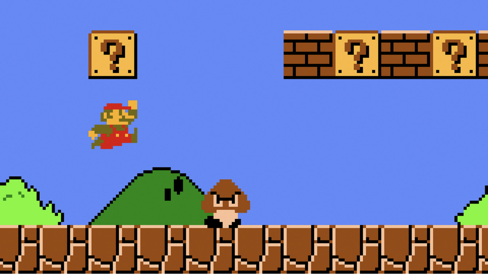
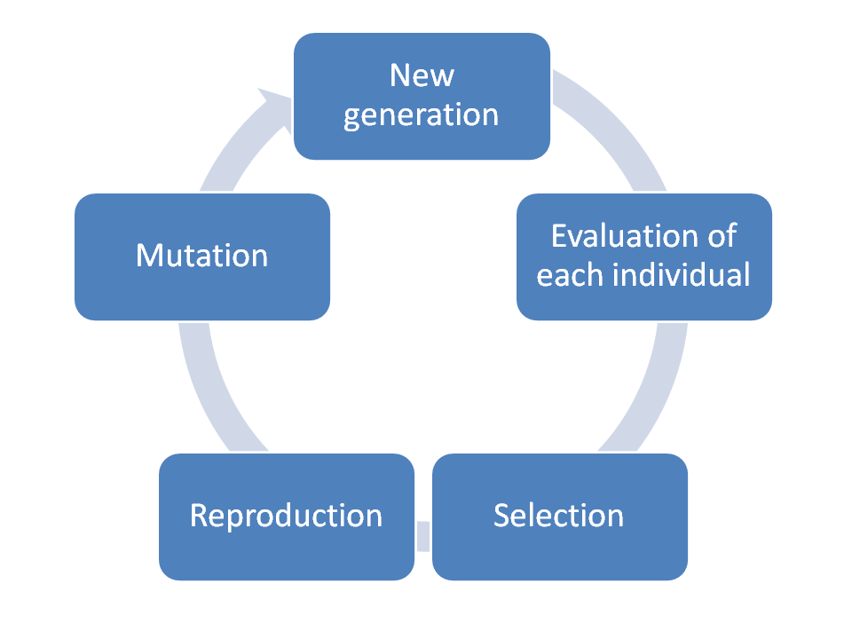
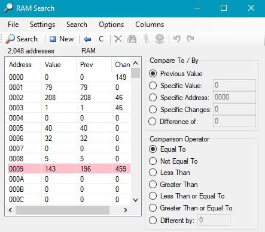
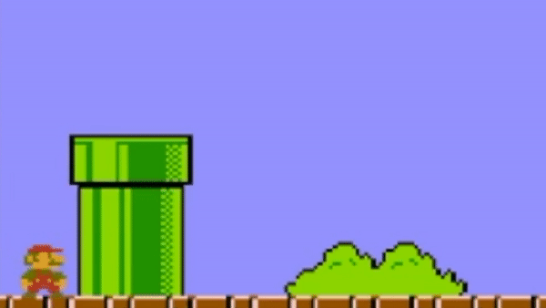
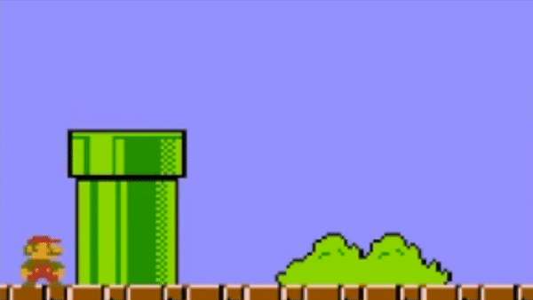

# Table of contents


1. [Disclaimer](#disclaimer)
2. [Problem](#problem)
3. [Technical preparing](#technical-preparing)
4. [Dive into genetic algorithms](#dive-into-genetic-algorithms)
    * [List of useful articles](#list-of-useful-articles)
5. [Making our algorithm smarter](#making-our-algorithm-smarter)
    * [List of useful articles](#list-of-useful-articles-1)
6. [Some useful information you must know about emulator and Mario](#some-useful-information-you-must-know-about-emulator-and-mario)
    1. [Mario, where are you or what is your position?](#mario-where-are-you-or-what-is-your-position)
    2. [How high does Mario jump?](#how-high-does-mario-jump)
    3. [How to control Mario?](#how-to-control-mario)
7. [Results](#results)
8. [Conclusion](#conclusion)

# Disclaimer
__I am a newbie in a genetic AI.__

My initial goal was to learn the techniques involved in genetic AI algorithms and show other people how I did it, where I had found the information, which problems I had etc.

I am aware that some of the things that I have written may not be conceptually correct. I will be grateful if you prevent me from making mistakes in the future. I am always ready to listen to your advice. Please write me on the email - ilopatin3@gmail.com

# Problem
Write a genetic AI algorithm which will be able to pass a level of a simple game like a "Super Mario Bros".



# Technical preparing
First of all, you must run the Mario on your machine. To achieve it you have to download a  [BizHawk emulator](http://tasvideos.org/BizHawk.html).

The next problem is to find the game. But don't worry I have already done it for you.
There is an excellent  [resource](https://emulator.games/roms/nintendo/) where you can find the one and even much more games.

I implemented the algorithm in Lua language. I did not know this language before but I was inspired  [how widely](https://en.wikipedia.org/wiki/List_of_applications_using_Lua) this lightweight, scripting language could be used. In addition, the BizHawk emulator run Lua without no hesitation.

# Dive into genetic algorithms
I cannot teach you a genetic algorithm, because — as I have mentioned — I have been still learning it. But I am glad to share useful links, where you can find the information for beginners.

Do not think that it is too complicated for you. Because it is not! The main idea of each genetic algorithm is to evolve the best possible solution from a set of elements. All you need is implement necessary functions. Then run the algorithm and .. that is all. The solution will be found by the algorithm. All you need is to wait.

The next figure will help you to imagine how the cycle of evolution looks.



## List of useful articles
* [Genetic Algorithms for Geometric Primitive Detection](http://cgm.cs.mcgill.ca/eden/PrimitiveGenetics/page2.htm) by Mark Grundland & Youenn Fablet
* [Introduction to Genetic Algorithms  —  Including Example Code](https://towardsdatascience.com/introduction-to-genetic-algorithms-including-example-code-e396e98d8bf3) by Vijini Mallawaarachchi
* [Was Darwin a Great Computer Scientist?](https://blog.sicara.com/getting-started-genetic-algorithms-python-tutorial-81ffa1dd72f9) by Louis Nicolle

# Making our algorithm smarter
There are [some](https://www.analyticsindiamag.com/6-types-of-artificial-neural-networks-currently-being-used-in-todays-technology/) types of Artificial Neural Networks. I decided to choose the easiest one - Feedforward Neural Network. Because it is understandable enough to use it for the first time.


As I'd chosen Lua language, I had to find the implementation of the neural network to use the one in my project and I did it.

__Soulkiller__ implemented this type of neural network in Lua, a page no longer exists but I found a copy of the page on web.archive.org. You can find it [here](https://web.archive.org/web/20130715031753/http://www.forums.evilmana.com/psp-lua-codebase/lua-neural-networks/). And if you want to comment or do some changes in the algorithm, you can do it in [gist](https://gist.github.com/cassiozen/de0dff87eb7ed599b5d0) by Cássio Souza.

It's very easy to use. For example, if you need to create a neural network with 2 input neurons, 1 output neuron, 1 hidden layers with 4 neurons in it and 30% rate at which the neural network learns, you should write the next shipped

```lua
network = NeuralNetwork.create(2, 1, 1, 4, 0.3)
```

.. then you need to teach your "network"

```lua
network:backwardPropagate({0,0},{0})
```

.. the first parameter `{0,0}` in the function is the input of the network. Here are two numbers - two neurons - as we created the network with two input neurons. And `{0}` is the desired output.
But it isn't enough to teach it one time! Yoy should repeat it much more time. You must test it by yourself.

And then, when our network is taught, we can use it

```lua
network:forewardPropagate(0,0)[1])
```

I recommend you to see some more examples [here](https://gist.github.com/cassiozen/de0dff87eb7ed599b5d0) (at the bottom of the page).

## List of useful articles
* [A Beginner’s Guide to Neural Networks: Part One](https://towardsdatascience.com/a-beginners-guide-to-neural-networks-b6be0d442fa4) by Nehal Udyavar
* [Understanding Feedforward Neural Networks](https://www.learnopencv.com/understanding-feedforward-neural-networks/) by Vikas Gupta

# Some useful information you must know about emulator and Mario
Some tips that can help to save your time.

## Mario, where are you or what is your position?
We have to know the position of Mario. But how will we find it out? We cannot send a request to API to get that information. So we have to find another way to do it.

And here it is. Let's I show you how to find out the X position of Mario. All we need is to find an address of a byte which contains this information.

To do this you must open __`Emulator`__, run the game and then go to __`Tools > RAM Search`__.

When you open it, you will see the next window:



So we can see a lot of addresses and their values but we don't know which is the right. So we need to do a few steps to find it out.

First, select __`Previous Value`__ and __`Equal To`__ on the right as it is done on the picture above. Then click __`New`__ button on the top.

Second, go to the game window and move your Mario to the left or right.

Then return to the RAM Search window and select __`Not Equal To`__  and then click __`Search`__ button on the top. This way you will 
eliminate a bunch of unnecessary addresses. Then return to the game window and keep changing Mario position during looking at __`Value`__ row in RAM Search. This way you will find out the right address.

## How high does Mario jump?
You can have a problem with "Why Mario doesn't jump?". It's because it isn't enough to click "jump" button one time. You must keep pressing the button during several frames and the longer you press the higher Mario jump.

Look at the gifs below. In the first case, the button was pressed during 5 frames, in the second and third 15 and 30, respectively.

  

## How to control Mario?
Another reason to write in Lua is there is an [API for BizHawk emulator](http://tasvideos.org/Bizhawk/LuaFunctions.html).

For example, if you need to write some debug information on a game screen, use __gui.drawText__

```lua
void gui.drawText(int x, int y, string message, [color? forecolor = null], [color? backcolor = null], [int? fontsize = null], [string fontfamily = null], [string fontstyle = null], [string horizalign = null], [string vertalign = null])
```

__joypad.set__ sets the given buttons to their provided values for the current frame

```lua
void joypad.set(nluatable buttons, [int? controller = null])
```

# Results
After 3 hours and 30 minutes, the algorithm was able to pass the level.


You can see the whole process (4h 40m) on YouTube [here](https://youtu.be/DAPWQkSlj7A) or the best populations (4m 20s) [here](https://youtu.be/IWxsJBKMzLc).

The parameters of the algorithm were:
* Chance of mutation: 50%
* Number of a population: 20

# Conclusion
I will be very happy if this article will help you in the beginnings of studying genetic algorithms.

I very strongly recommend watching a [video](https://www.youtube.com/watch?v=qv6UVOQ0F44) about MarI/O by SethBling.

And lastly,

* You can use my code. It is completely free.
* If you notice any inaccuracies, please let me know about it.
* If you have useful materials for studying this topic, please write to me, it will be useful for me.
* I plan to update/improve the algorithm.
* If you are new to this, read the articles that I mentioned above, they really will give you a basic understanding.
